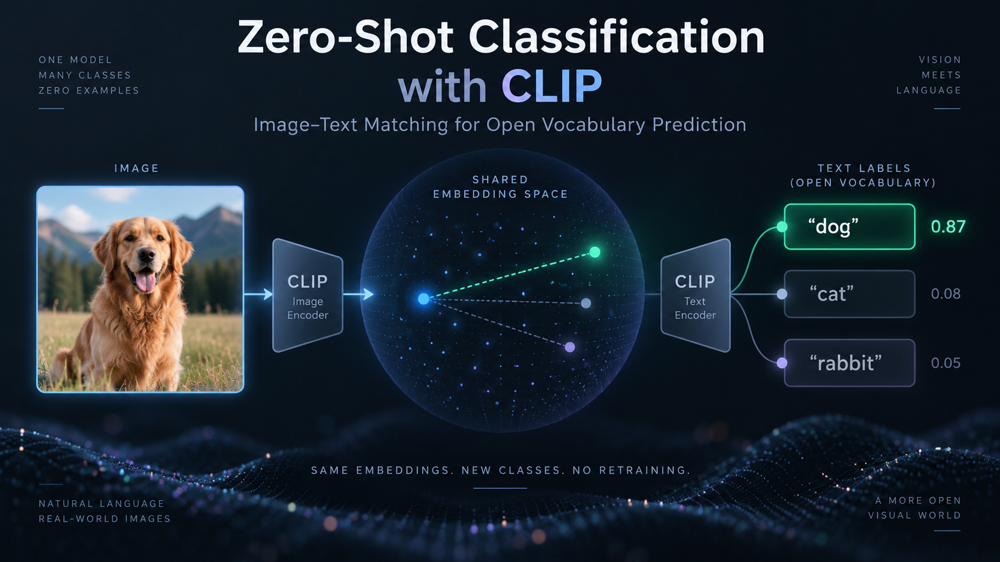
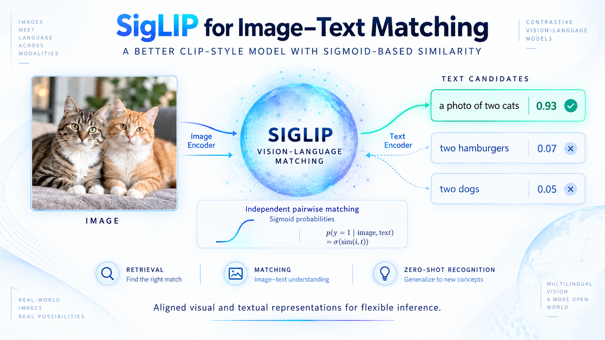
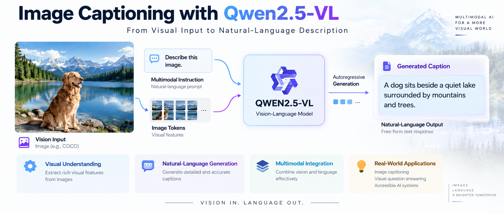
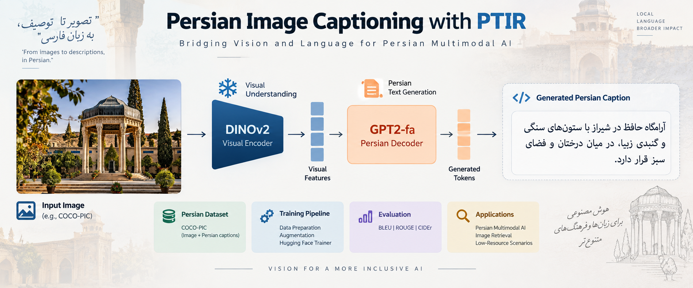
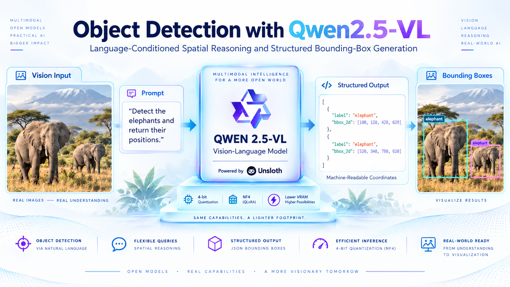

## `01__CLIP_Embeddings(1).ipynb`

This notebook provides a practical introduction to **multimodal embeddings using CLIP (Contrastive Language–Image Pre-training)**. Its main objective is to demonstrate how text and images can be transformed into numerical feature vectors that occupy the same semantic embedding space. The notebook uses the pretrained `openai/clip-vit-base-patch32` model from Hugging Face and gradually explores text embeddings, image embeddings, and cross-modal similarity.

The workflow begins with several simple text descriptions such as `"a donut"`, `"a cookie"`, `"an airplane"`, and `"a cat"`. These strings are tokenized using CLIP’s tokenizer and passed through the text encoder to obtain fixed-dimensional semantic representations. The notebook then calculates pairwise **cosine similarity** between these text embeddings to illustrate how CLIP represents semantically related and unrelated concepts. A similarity matrix is visualized as a heatmap, making the structure of the learned embedding space easier to interpret.

The same idea is then applied to images corresponding to the selected concepts. Images are downloaded, preprocessed using `CLIPProcessor`, and passed through CLIP’s vision encoder to obtain image embeddings. Image-to-image cosine similarities are calculated and displayed in another heatmap, providing a visual demonstration of how CLIP measures visual similarity.

Finally, the notebook compares **text embeddings directly with image embeddings**. This cross-modal comparison is the key idea behind CLIP: an image and a text description referring to the same concept should have relatively similar representations despite originating from different modalities. The resulting image–text similarity matrix demonstrates how CLIP can connect natural-language descriptions with visual content.

Overall, this notebook focuses on the foundation behind many VLM applications. Rather than performing a specific downstream task, it explains how a shared image–text embedding space can support applications such as semantic search, image retrieval, zero-shot classification, and multimodal matching.

---

## `02__Zero-Shot-Classification-CLIP(1).ipynb`

  

This notebook demonstrates **zero-shot image classification using CLIP**, showing how an image can be classified into user-defined categories without training a new classifier or providing task-specific training examples. It uses the pretrained `openai/clip-vit-base-patch32` model and its corresponding `CLIPProcessor` to compare a visual input against several natural-language class labels.

A sample image is loaded from the COCO dataset and three candidate classes—`"cat"`, `"dog"`, and `"rabbit"`—are provided directly as text. Instead of using a conventional neural-network classification head with a fixed set of classes, CLIP encodes both the image and these textual labels into its shared multimodal representation space. This means that the classes can be changed at inference time without retraining the model, which is the central idea behind zero-shot classification.

The notebook also provides a useful look at CLIP’s preprocessing pipeline. `CLIPProcessor` handles image resizing, cropping, normalization, text tokenization, padding, and conversion to PyTorch tensors. Intermediate inputs such as `input_ids`, `attention_mask`, and `pixel_values` are inspected to clarify how raw images and text are transformed before entering the model.

During the forward pass, CLIP produces text embeddings, image embeddings, and most importantly `logits_per_image`, which represent the model’s similarity scores between the image and each candidate label. The notebook also examines CLIP’s learned logit scaling factor, which scales cosine similarities before classification. A **softmax** operation is then applied across the candidate classes to convert these scores into normalized probabilities, and the class with the highest probability becomes the final prediction.

The notebook therefore serves as a compact implementation of CLIP-based zero-shot classification while also explaining what happens internally. It connects the embedding concepts introduced in the previous notebook to a concrete downstream task, demonstrating why vision-language pretraining allows new visual categories to be introduced simply through natural-language prompts.

---

## `03_Inference_with_(multilingual)_SigLIP_a_better_CLIP_model(1).ipynb`

  

This notebook introduces **SigLIP (Sigmoid Loss for Language–Image Pre-training)** and demonstrates how it can be used for image–text matching. Conceptually, SigLIP follows the same general vision-language paradigm as CLIP: separate image and text encoders learn representations that allow visual content to be associated with natural-language descriptions. The major distinction discussed in the notebook is the learning objective used during pretraining.

While traditional CLIP relies on a contrastive softmax-based objective that compares image–text pairs relative to all other pairs in a batch, SigLIP formulates image–text matching using a **sigmoid loss**. Each image–text pair can therefore be evaluated more independently as a matching or non-matching pair. The notebook explains that this formulation avoids the global normalization required by CLIP’s softmax objective and can support efficient training with very large batches.

For inference, the notebook loads the `google/siglip-so400m-patch14-384` checkpoint through Hugging Face’s `AutoModel` and `AutoProcessor`. Although the notebook filename refers to multilingual SigLIP, the particular checkpoint used in the implementation is presented in the notebook as the shape-optimized English model. A COCO image containing cats is evaluated against three candidate descriptions: a photo of two cats, two hamburgers, and two dogs.

The processor jointly prepares the image and text inputs, including resizing the image to the model’s required resolution and padding the text sequences to the expected length. After a forward pass, the notebook extracts `logits_per_image` and applies **sigmoid rather than softmax**. Consequently, each image–text probability is interpreted independently and the probabilities do not need to sum to one.

This notebook is therefore useful both as an inference example and as a conceptual comparison between CLIP and SigLIP. It demonstrates how a different training objective changes the interpretation of similarity scores while preserving the broader idea of learning aligned visual and textual representations for retrieval, matching, and zero-shot visual recognition.

---

## `04_Image-Captioning_with_Qwen 2.5-VL(1).ipynb`

  

This notebook moves from embedding-based vision-language models to a **generative multimodal model**, demonstrating image captioning with `Qwen/Qwen2.5-VL-3B-Instruct`. Instead of merely calculating the similarity between an image and predefined text candidates, Qwen2.5-VL receives visual information together with a natural-language instruction and generates a free-form textual response describing the image.

The notebook first loads the 3-billion-parameter instruction-tuned Qwen2.5-VL model and its `AutoProcessor`. A sample image is downloaded and provided to the model together with the request `"Describe this image."`. The implementation highlights Qwen’s chat-style input format, where multimodal content is represented as a sequence of messages containing roles such as `user`, along with separate image and text components.

An important part of the notebook is the preparation of multimodal inputs. `apply_chat_template` converts the structured message into the special prompt format expected by Qwen, including the appropriate vision markers and generation prompt. The `process_vision_info` utility then extracts and prepares image or video information from the message structure. Finally, the processor combines the textual prompt and visual inputs into tensors that can be passed directly to the model.

Caption generation is performed autoregressively using `model.generate()`. The notebook carefully separates newly generated tokens from the original input tokens and decodes only the model’s response. The generated caption is then displayed alongside the source image. In the provided example, the model produces a detailed natural-language description of a dog beside a lake and surrounding landscape.

The notebook is intentionally focused on the core inference pipeline rather than training or fine-tuning. It demonstrates the practical transition from contrastive VLMs such as CLIP and SigLIP to **instruction-following Vision-Language Models**, where vision is integrated into a conversational language-model interface. The same basic workflow can subsequently be adapted for visual question answering, OCR, scene reasoning, document understanding, or more specialized multimodal prompts.

---

## `05_Persian_Image_Captioning_PTIR(1).ipynb`

  

This notebook provides the most complete training-oriented example in the collection, focusing on **Persian image captioning within the PTIR framework**. PTIR is designed for Persian multimodal applications and combines Persian image caption generation with text embeddings and vector-based retrieval. This notebook concentrates primarily on the captioning component and demonstrates both inference with an existing pretrained model and construction of a Vision Encoder–Decoder model for training.

The data source is the `rasoulasadianub/coco-pic` dataset, which contains images paired with Persian captions. The notebook first explores sample image–caption pairs and includes utilities for correctly displaying Persian text using Arabic reshaping and bidirectional text handling. It then loads the pretrained `shenasa/persian-image-captioning` model and generates captions for example images.

The captioning architecture combines **DINOv2-base as the visual encoder** with `GPT2-fa` as the Persian-language decoder. Images are transformed into visual representations by DINOv2, while the autoregressive Persian decoder generates the corresponding caption. The notebook demonstrates this architecture through Hugging Face’s `VisionEncoderDecoderModel`.

A second major section shows how the model can be assembled and trained using `facebook/dinov2-base` and `HooshvareLab/gpt2-fa`. The COCO-PIC data is divided into training, validation, and test subsets, and modest image augmentations such as color jitter, affine transformations, perspective changes, and rotation are applied during training. Hugging Face `Trainer` and `TrainingArguments` are then used to manage optimization, evaluation, checkpointing, mixed-precision execution, and gradient accumulation.

The notebook also contains an evaluation pipeline. Captions generated by both the pretrained model and a newly trained checkpoint are stored alongside their reference captions, allowing systematic comparison. Standard caption-generation metrics including **BLEU, ROUGE, and CIDEr** are subsequently calculated.

Overall, this notebook goes beyond simple VLM inference. It demonstrates a complete Persian multimodal workflow spanning dataset preparation, pretrained inference, encoder–decoder construction, training, caption generation, and quantitative evaluation, making it particularly relevant for low-resource and non-English vision-language applications.

---

## `06_Object_Detection_Using_Qwen_2_5VL_unsloth.ipynb`

  

This notebook demonstrates how a generative Vision-Language Model can be used for **object detection and spatial reasoning** without relying on a conventional object-detection architecture such as YOLO or Faster R-CNN. The implementation uses the 7-billion-parameter `unsloth/Qwen2.5-VL-7B-Instruct` checkpoint and prompts the model to identify requested objects and return their spatial coordinates in a structured format.

Because a 7B multimodal model can require substantial GPU memory, the notebook uses `bitsandbytes` **4-bit quantization**. The configuration uses NF4 quantization, double quantization, and reduced-precision computation, allowing the model to run with considerably lower VRAM consumption while retaining the general Qwen2.5-VL inference pipeline.

A sample image containing elephants is supplied to the model. Rather than simply asking for a textual description, the system prompt explicitly defines Qwen’s task as object detection and instructs it to return JSON objects containing a `bbox_2d` field with `[x1, y1, x2, y2]` coordinates and a corresponding object `label`. The user can then issue natural-language requests such as asking the model to outline the positions of elephants.

The multimodal request is transformed using Qwen’s chat template, while `process_vision_info` extracts and preprocesses the visual input. After autoregressive generation, the notebook removes the prompt tokens and decodes the generated response. Since generative models can occasionally produce malformed formatting, dedicated utilities clean the output, repair problematic newlines inside strings, remove Markdown code fences, and convert the result into a valid Python/JSON structure.

A visualization utility subsequently draws the returned bounding boxes and labels over the original image, providing a direct visual check of the model’s spatial predictions.

The notebook illustrates an important capability of modern VLMs: visual localization can be expressed as **language-conditioned structured generation** rather than a fixed detection head. This enables flexible object queries and spatial reasoning through natural-language instructions while still producing machine-readable coordinates suitable for downstream computer-vision pipelines.

---

## `07_Multimodal-LLMs-Gemma3.ipynb`

This notebook introduces **Google Gemma 3** as a family of multimodal, multilingual, long-context models and combines architectural background with practical inference examples. It covers the 1B, 4B, 12B, and 27B variants, emphasizing that the larger Gemma 3 models support image and text inputs while providing substantially longer context windows than the previous Gemma generation.

The notebook first discusses the technical improvements behind Gemma 3, particularly longer-context processing, multilingual support, and multimodality. For visual understanding, Gemma 3 incorporates a **SigLIP-based vision encoder** that converts visual information into representations consumed by the language model. The notebook also describes mechanisms used to handle image resolution and aspect-ratio constraints and explains how the architecture combines visual input with the language-model generation process.

Practical inference is demonstrated using the instruction-tuned `google/gemma-3-4b-it` model. The first implementation uses the high-level Hugging Face `image-text-to-text` pipeline. An image of a tennis player is paired with a question requesting the sport and player name, demonstrating visual recognition combined with natural-language reasoning.

A more detailed implementation then uses `Gemma3ForConditionalGeneration` together with `AutoProcessor`. Multimodal messages are converted through the model’s chat template and passed directly to `generate()`. One example asks a question in **Persian** about information visible in an image, illustrating both visual understanding and multilingual interaction.

The notebook additionally distinguishes multimodal inference from text-only Gemma usage. `Gemma3ForCausalLM` and `AutoTokenizer` are introduced for cases where the vision tower is unnecessary, showing that the architecture can also operate purely as a language model. Finally, the notebook discusses lower-resource deployment using quantized **GGUF models and llama.cpp**.

Rather than focusing on a single application, this notebook acts as a broader Gemma 3 overview. It demonstrates how the same model family can support image question answering, multilingual multimodal interaction, conventional text generation, and local or resource-constrained inference.

---

## `08_Multimodal_apple_fastVLM.ipynb`

This notebook demonstrates multimodal inference using Apple’s lightweight **`FastVLM-0.5B`** model. In contrast to the larger multimodal models used elsewhere in the repository, this example focuses on a relatively compact Vision-Language Model and provides a more explicit look at how textual tokens and visual information are combined before generation.

The model and tokenizer are loaded from `apple/FastVLM-0.5B` through Hugging Face with `trust_remote_code=True`. The notebook does not hide multimodal preparation behind a single high-level processor call. Instead, it manually constructs the sequence expected by FastVLM. A chat-style prompt contains an `<image>` placeholder, and the text appearing before and after this placeholder is tokenized separately. The notebook then inserts FastVLM’s special **image token identifier (`-200`)** between the two text segments to indicate where visual features should enter the sequence.

The actual image is independently processed using the image processor associated with the model’s vision tower. These pixel values, the manually constructed token sequence, and the attention mask are then passed to `model.generate()`. This implementation gives a useful view of the interface between the vision encoder and the language-model component of a VLM.

Two inference scenarios are demonstrated. The first uses an image of a hand gesture and asks the model how many fingers are being held up. The prompt strongly constrains the response to a single digit, and generation is limited to one new token. The second example loads an image containing cats and requests a detailed free-form description, allowing a substantially longer generated response.

The notebook therefore demonstrates both **constrained visual question answering and open-ended image captioning** using the same compact model. It is particularly useful for understanding how multimodal tokens are inserted into a language-model prompt and how lightweight VLMs can support visual reasoning without requiring models with billions of additional parameters.

---

## `09_video_understanding_Qwen_2.5_VL.ipynb`

This notebook extends Qwen2.5-VL beyond static-image understanding and explores a range of **video understanding tasks** using `Qwen/Qwen2.5-VL-7B-Instruct`. It is the most temporally oriented notebook in the collection, covering general video description, recognition of textual information inside videos, long-video comprehension, temporal grounding, and structured event captioning.

The model is loaded in `bfloat16` precision with **Flash Attention 2** and automatic device mapping. Because video inference produces a large number of visual tokens, the notebook explicitly notes its substantial hardware requirements and targets a powerful NVIDIA GPU. Video decoding and frame handling are implemented with `decord`. Utility functions can download remote videos, uniformly sample frames across their duration, preserve frame timestamps, cache processed data, and arrange sampled frames into visual grids.

A reusable inference function constructs Qwen’s multimodal chat input, processes the video with `process_vision_info`, and forwards the resulting text and video tensors to the model. Parameters such as `total_pixels` and `min_pixels` allow the visual representation and computational workload to be controlled. The notebook also reports the resulting frame tensor dimensions and approximate number of video tokens, which is especially useful when processing longer sequences.

Several applications are demonstrated. The model first produces general descriptions of videos. It is then asked to **read and summarize textual information appearing inside videos**, returning results in table form. A long-video example evaluates its ability to describe extended content rather than isolated frames.

The notebook subsequently introduces **video grounding**, where a textual query such as `"seasoning the steak"` is localized to a particular time interval. Finally, Qwen is prompted to identify multiple events, return their start and end timestamps, and describe each event in structured JSON. The generated JSON is parsed, timestamps are converted into seconds, and corresponding sampled frames are displayed beside each event description.

Overall, this notebook demonstrates that a VLM can perform not only frame-level recognition but also temporal reasoning, event localization, OCR-like video analysis, long-context visual understanding, and structured video summarization.
